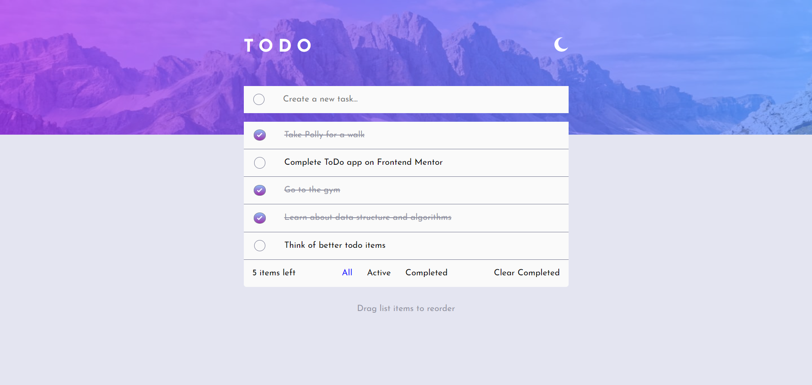
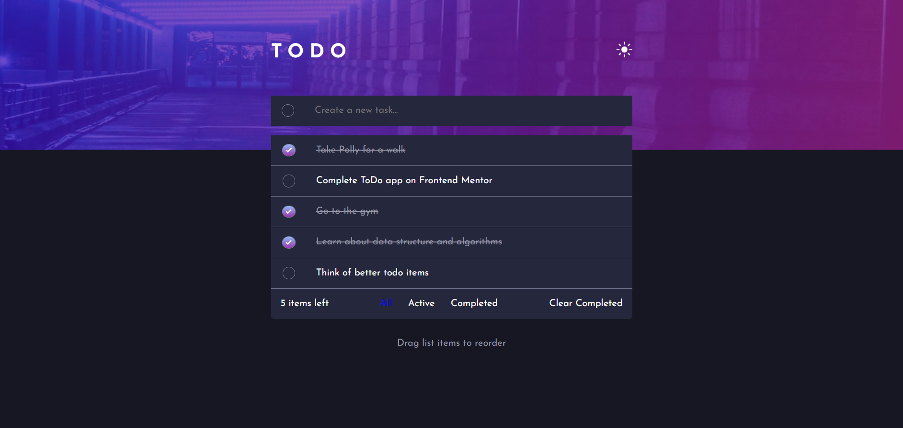

# Frontend Mentor - Todo app solution

This is a solution to the [Todo app challenge on Frontend Mentor](https://www.frontendmentor.io/challenges/todo-app-Su1_KokOW).

## Table of contents

- [Overview](#overview)
  - [The challenge](#the-challenge)
  - [Screenshot](#screenshot)
  - [Links](#links)
- [My process](#my-process)
  - [Built with](#built-with)
  - [What I learned](#what-i-learned)
- [Author](#author)

## Overview

### The challenge

Users should be able to:

- View the optimal layout for the app depending on their device's screen size
- See hover states for all interactive elements on the page
- Add new todos to the list
- Mark todos as complete
- Delete todos from the list
- Filter by all/active/complete todos
- Clear all completed todos
- Toggle light and dark mode
- **Bonus**: Drag and drop to reorder items on the list

### Screenshot (Light Mode)

### Screenshot (Dark Mode)

### Links

- [GitHub Repo](https://github.com/DanB-Web/FEM_Todo)
- [Netlify Site](https://dba-fem-todo.netlify.app/)

## My process

### Built with

- [React](https://reactjs.org/)
- [Sass](https://sass-lang.com/)
- [React Beutiful DnD](https://github.com/atlassian/react-beautiful-dnd)
- [Figma](https://www.figma.com/)
- [Netlify](https://www.netlify.com/)

### What I learned

This was another Frontend Mentor project that I built from a Figma file and a basic design brief. There were a few interesting requirements that allowed me to make a simple Todo list a bit more interacvtive and engaging, such as:

- Drag and drop functionality to reorder the list, via React Beautiful Drap and Drop

- A dark mode option - I also added a transition time to so that it fades between modes rather than abruptly switching

- The banner image SVG changes depending on the mode and the window size

- You can filter the list view between all, completed and uncompleted list items. I also added an active class so it was obvious which view was activated.

## Author

- Website - [Dan Bayford](https://dba-portfolio.netlify.app/)
- Frontend Mentor - [@DanB-Web](https://www.frontendmentor.io/profile/DanB-Web)
